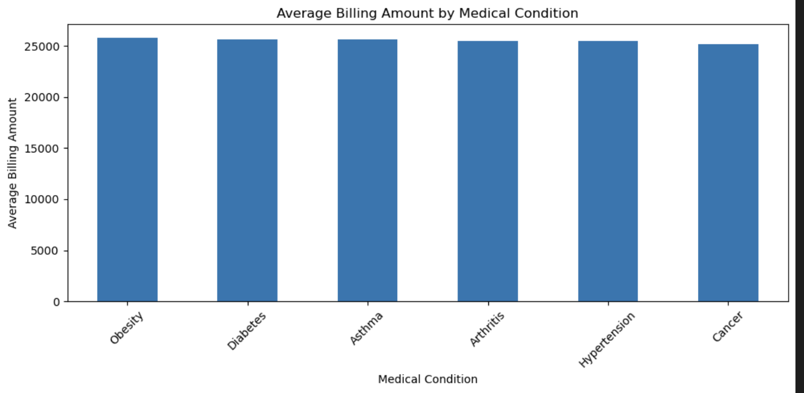
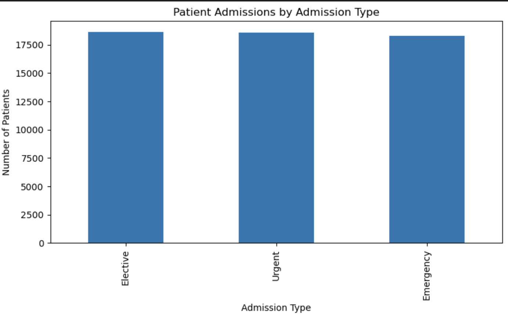
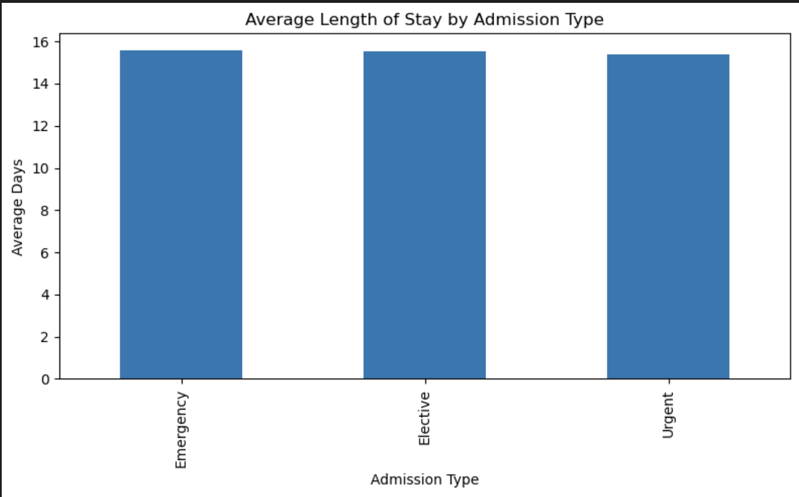
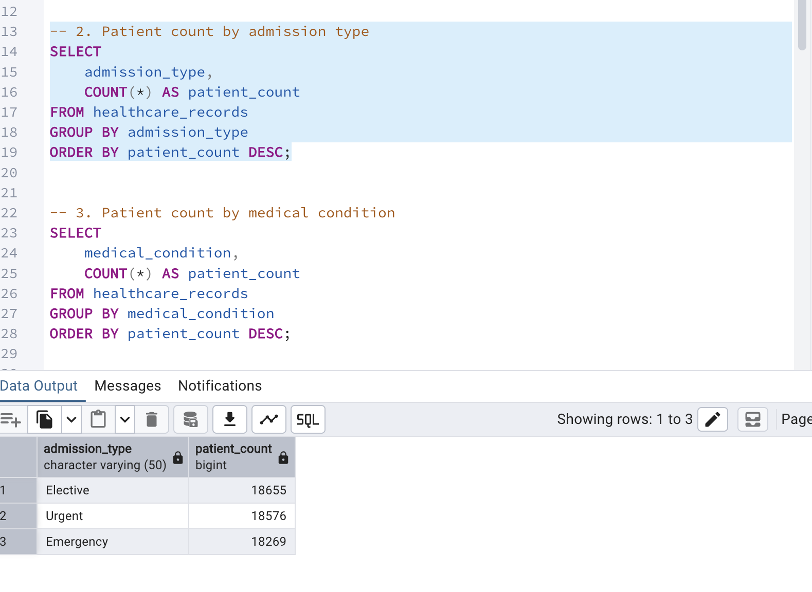
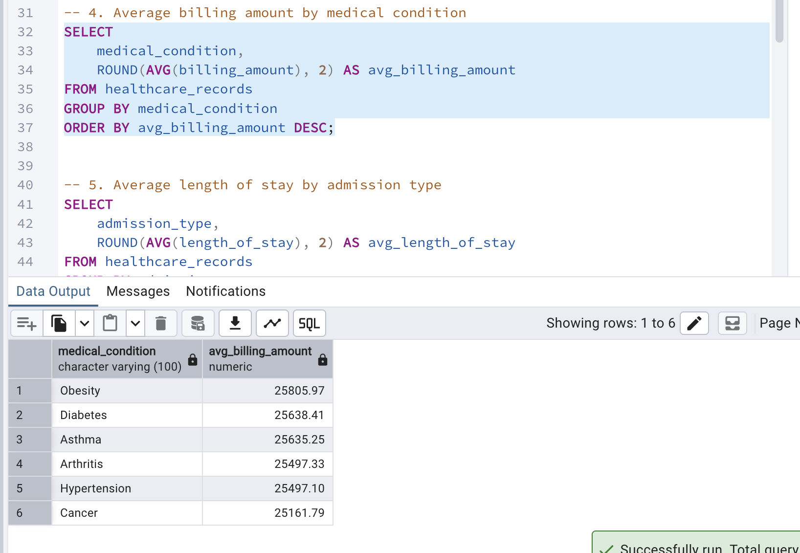
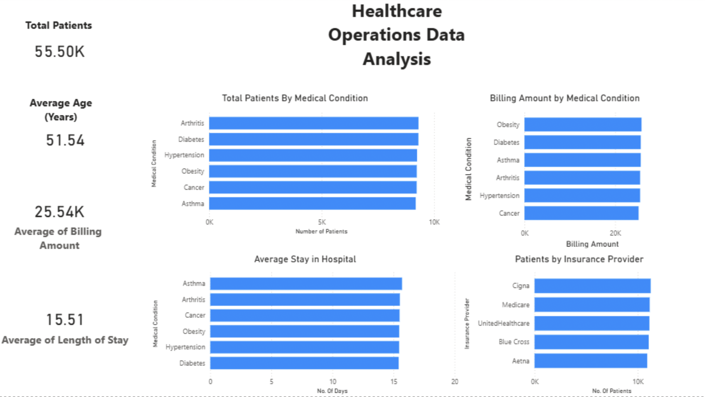

# Healthcare Operations Analysis

## Overview

This project analyzes healthcare operations data using Python, PostgreSQL, SQL, and Power BI. The goal was to explore patient admissions, billing activity, insurance provider distribution, and healthcare utilization metrics while demonstrating an end-to-end analytics workflow.

## Business Questions

- Which medical conditions account for the highest patient volume?
- How are patients distributed across admission types?
- Which insurance providers cover the largest number of patients?
- What are the average billing amounts across medical conditions?
- How does average length of stay vary across admission categories?
- What operational insights can be identified through dashboard reporting?

---

## Tools Used

- Python (Pandas, Matplotlib)
- PostgreSQL
- SQL
- Power BI
- Jupyter Notebook
- GitHub

---

## Dataset

The dataset contains approximately 55,500 healthcare records including:

- Patient demographics
- Medical conditions
- Admission types
- Insurance providers
- Billing amounts
- Admission and discharge dates
- Test results

A Length of Stay metric was engineered during the Python analysis phase to support operational reporting.

---

# Python Data Preparation

Python was used to inspect, clean, transform, and prepare the dataset for SQL and Power BI analysis.

### Billing Amount by Medical Condition



Billing amounts were analyzed across medical conditions to identify potential differences in healthcare costs and utilization patterns.

---

### Patient Admissions by Admission Type



Patient admissions were analyzed across Emergency, Urgent, and Elective categories to understand admission distribution patterns.

---

### Average Length of Stay by Admission Type



Length of Stay was calculated using admission and discharge dates and analyzed across admission categories to evaluate hospitalization duration trends.

---

# SQL Analysis

The cleaned dataset was imported into PostgreSQL for further analysis.

### Patient Distribution by Admission Type



SQL aggregation queries were used to evaluate patient volume across admission categories.

---

### Average Billing Amount by Medical Condition



SQL analysis was used to compare average billing amounts across medical conditions.

---

# Power BI Dashboard



The Power BI dashboard provides an operational overview of healthcare activity, including:

- Total Patients
- Average Age
- Average Billing Amount
- Average Length of Stay
- Patient Distribution by Medical Condition
- Insurance Provider Distribution
- Admission Type Analysis

---

## Key Findings

- Patient admissions were distributed relatively evenly across admission categories.
- Average billing amounts showed limited variation across major medical conditions.
- Length of stay remained relatively consistent across admission types.
- Insurance provider distribution was balanced across the dataset.
- The dataset provided a useful foundation for healthcare operations reporting and dashboard development.

---

## Repository Structure

```text
healthcare-operations-analysis/
│
├── data/
│   ├── healthcare_dataset.csv
│   └── healthcare_cleaned.csv
│
├── notebooks/
│   └── healthcare_operations_analysis.ipynb
│
├── sql/
│   └── healthcare_analysis_queries.sql
│
├── powerbi/
│   └── healthcare_operations_dashboard.pbix
│
├── screenshots/
│   ├── python_missing_values.png
│   ├── python_admission_type_analysis.png
│   ├── python_length_of_stay_analysis.png
│   ├── sql_admission_type_analysis.png
│   ├── sql_billing_by_condition.png
│   └── powerbi_dashboard_overview.png
│
└── README.md
```

---

## Skills Demonstrated

- Data Cleaning
- Exploratory Data Analysis (EDA)
- Feature Engineering
- SQL Query Development
- Data Aggregation
- Data Visualization
- Dashboard Development
- Business Intelligence Reporting
- Power BI Reporting
- Python Data Analysis
- PostgreSQL Analytics
